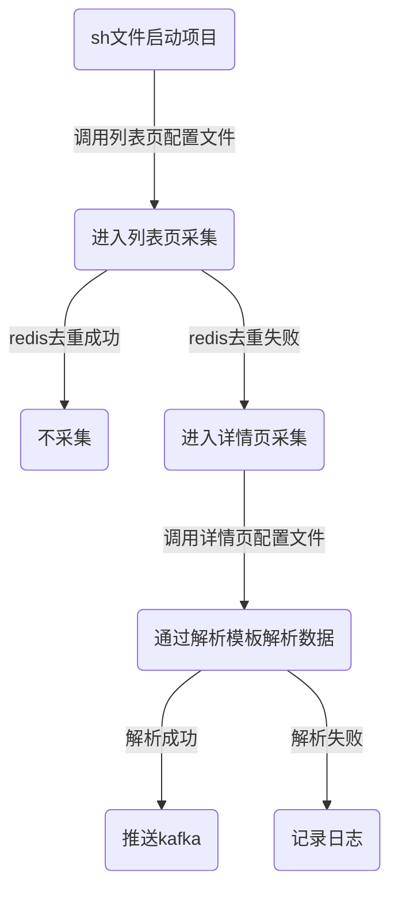

## 中心采集项目
### 一、项目结构
- [header_spider](./header_spider)
  - [header_spider.py](./header_spider/header_spider.py): 重点新闻采集
  - [hot_web.py](./header_spider/hot_web.py): 热榜采集
- [log](./log): 日志文件夹
- [setting](./setting): 配置
  - [db_config.py](./setting/db_config.py): 数据库配置
  - [host_xpath.json](./setting/host_xpath.json): 正文配置文件
  - [hot_spider.json](./setting/hot_spider.json): 热榜列表页采集配置文件
  - [one_spider.json](./setting/one_spider.json): 重点新闻列表页采集配置文件
- [tools](./tools): 配置
  - [base_tools.py](./tools/base_tools.py): 基本工具
  - [mini_down.py](./tools/mini_down.py): 文件，图片存储
  - [push_service.py](./tools/push_service.py): 数据推送
  - [req_tools.py](./tools/req_tools.py): ja3指纹请求工具
- [base_spider.py](./base_spider.py): 源采集程序
- [run_head.py](./base_spider.py): 重点新闻启动程序
- [run_hot.py](./base_spider.py): 热榜启动程序
- [中心采集.md](./中心采集.md): 项目说明文档

### 二、采集流程

### 三、采集部署
|服务器|文件路径|启动文件|
|-----|-------|------|
|8.222.217.186|/u01/isi/llu/liu_news/temporary_spider|start_head.sh|
